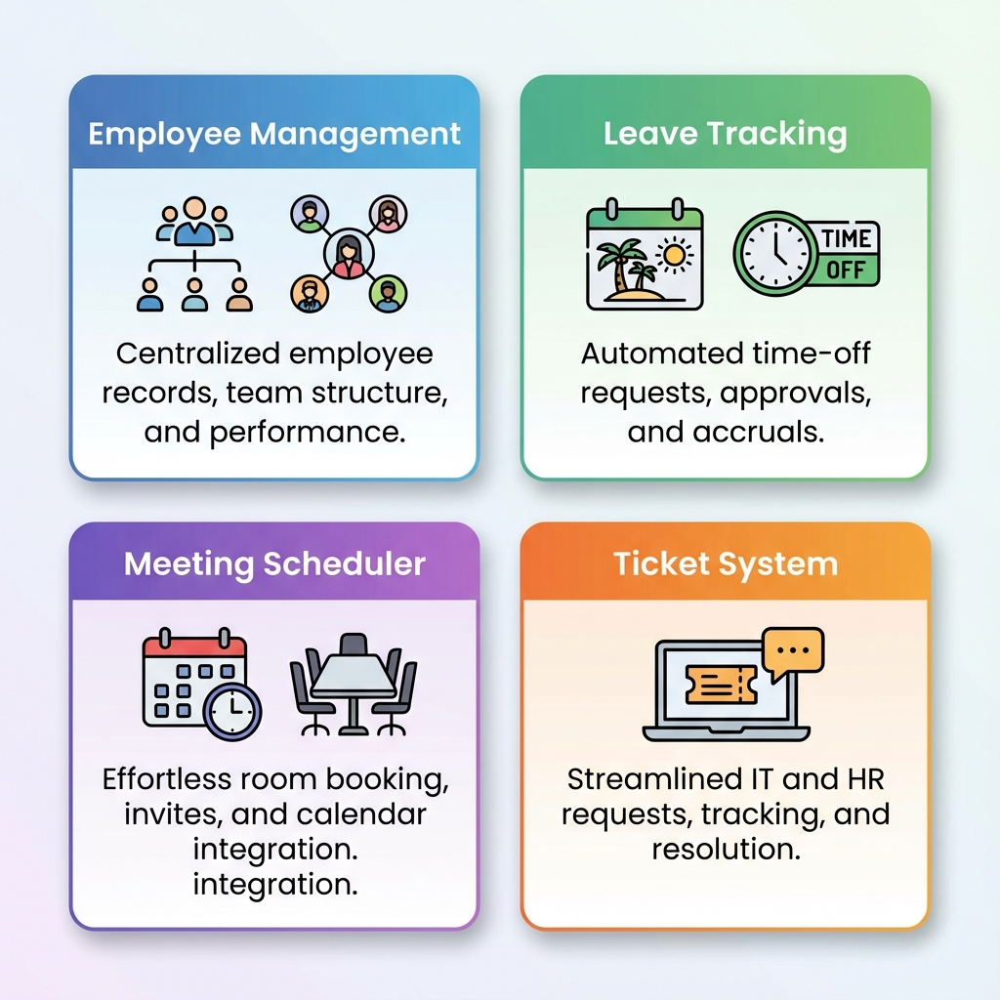
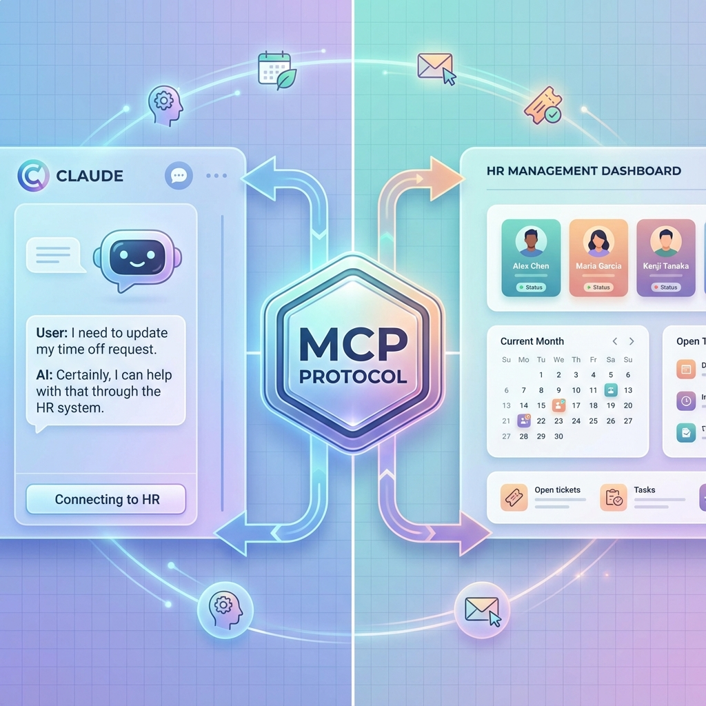
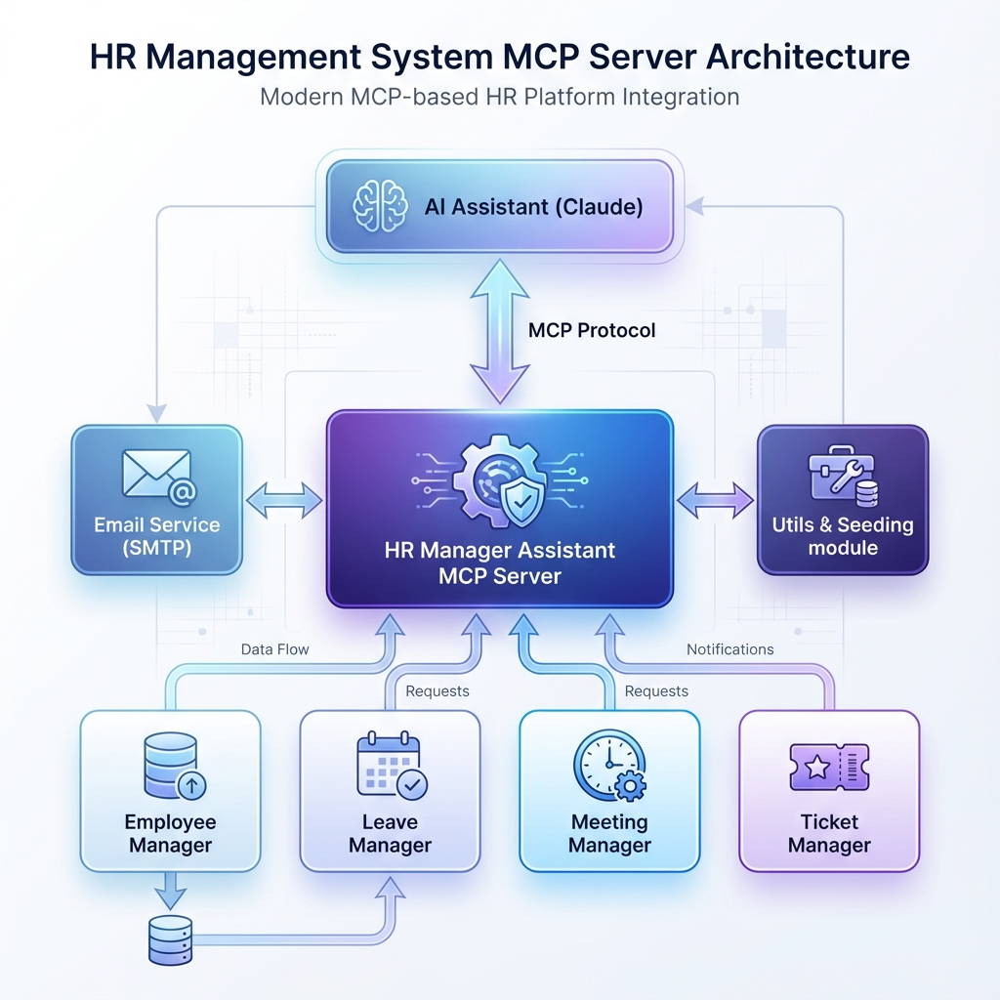
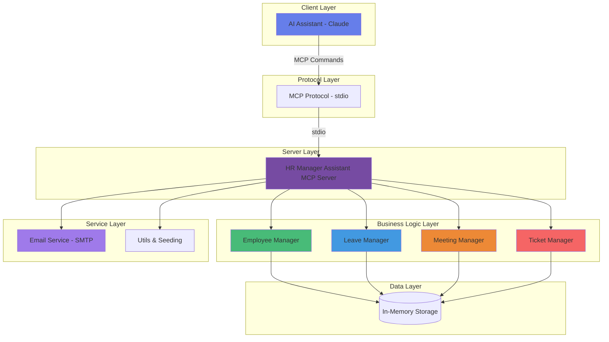
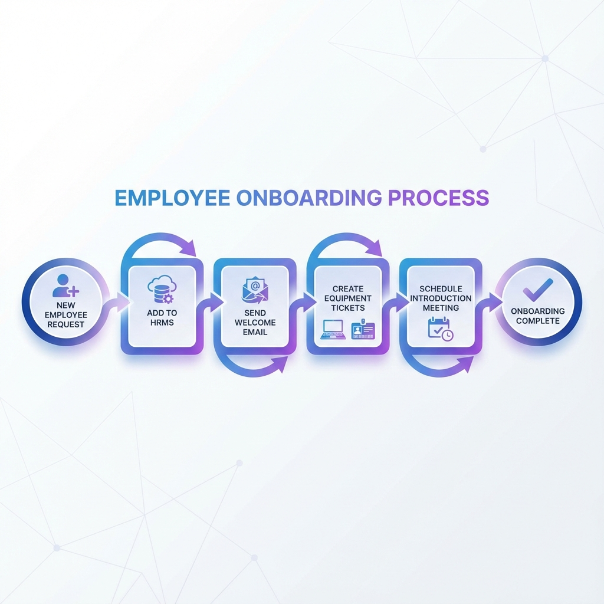
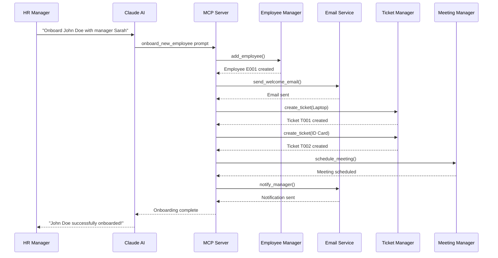
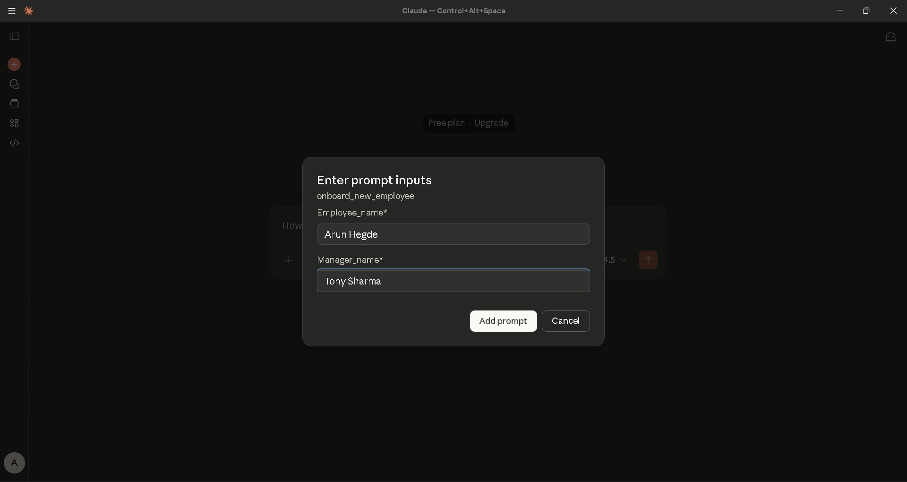
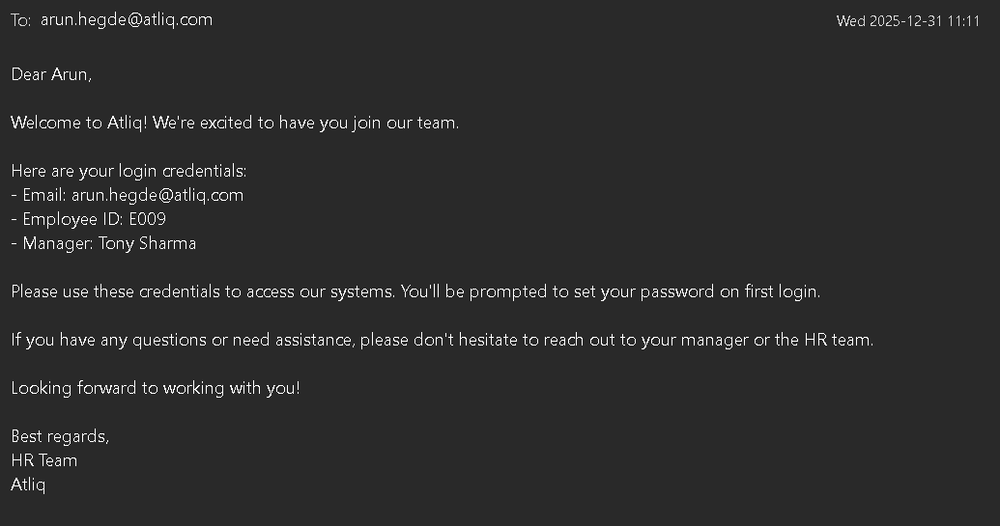
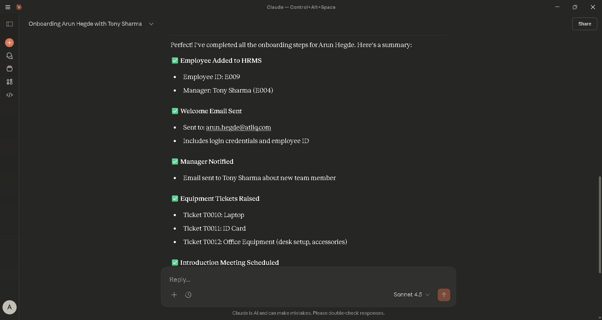

# 🏢 HR Manager Assistant (MCP Server)

<div align="center">



**An intelligent HR Management System built as a Model Context Protocol (MCP) server**

[](https://www.python.org/downloads/)
[](https://modelcontextprotocol.io/)
[](https://opensource.org/licenses/MIT)

</div>

---

## 📖 Overview

HR Manager Assistant is a comprehensive HR Management System that integrates seamlessly with AI assistants like Claude through the Model Context Protocol (MCP). It enables natural language HR operations including employee management, leave tracking, meeting scheduling, and ticketing capabilities.



---

## 🎯 Why This Project?

Traditional HR systems rely on rigid UIs and manual workflows.  
This project demonstrates how **AI assistants + MCP** can transform HR operations into **natural language-driven workflows**, reducing friction, improving productivity, and enabling intelligent automation.

This project is ideal for:
- AI Platform Engineers
- Backend Engineers
- MCP / Tool-Calling system designers
- HR Tech innovation use cases


## 🏗️ System Architecture

The system follows a modular architecture with clear separation of concerns:



### Architecture Components



---

## ✨ Features

### 👥 Employee Management
- Add new employees to the HRMS system
- Search and retrieve employee details
- Track employee-manager relationships
- Maintain employee email records

### 📅 Leave Management
- Check leave balances for employees
- Apply for leaves with multiple dates
- View complete leave history
- Automatic leave balance tracking

### 📝 Ticket System
- Create tickets for equipment requests (laptops, ID cards, etc.)
- Update ticket status (Open, In Progress, Closed, Rejected)
- List tickets with optional status filtering
- Track ticket creation and update timestamps

### 🤝 Meeting Management
- Schedule meetings with employees
- View all scheduled meetings
- Cancel meetings by date and topic
- Datetime-based meeting tracking

### 📧 Email Integration
- Send emails directly through the system
- Support for HTML and plain text emails
- Automated notifications for onboarding and other events

---

## 👋 Employee Onboarding Workflow


The system includes an intelligent onboarding workflow that automates the entire process:



### Workflow Steps



---

## 🛠️ Technology Stack

| Component | Technology | Version |
|-----------|-----------|---------|
| **Language** | Python | 3.13+ |
| **MCP Framework** | FastMCP | 1.25.0+ |
| **Data Validation** | Pydantic | 2.12.5+ |
| **Email** | SMTP (Gmail) | Built-in |
| **Environment** | python-dotenv | 1.0.0+ |

---

## 📋 Prerequisites

- Python 3.13 or higher
- Gmail account (for email functionality)
- App-specific password for Gmail (if using 2FA)

---

## 🔧 Installation

### 1️⃣ Clone the repository
```bash
git clone https://github.com/Arun-Hegde/HR-Manager-Assistant.git
cd Project-HR-Manager-Assistant
```

### 2️⃣ Create a virtual environment
```bash
python -m venv .venv
source .venv/bin/activate  # On Windows: .venv\Scripts\activate
```

### 3️⃣ Install dependencies
```bash
pip install -r requirements.txt
```

### 4️⃣ Set up environment variables

Create a `.env` file in the root directory:
```env
EMAIL_ID=your-email@gmail.com
EMAIL_PWD=your-app-specific-password
```

> **Note**: For Gmail, you need to generate an [App Password](https://support.google.com/accounts/answer/185833) if you have 2-factor authentication enabled.

---

## 🚀 Usage

### Running as MCP Server

```bash
python server.py
```

The server will start and listen for MCP protocol commands via stdio.

### Integrating with Claude Desktop

Add this configuration to your Claude Desktop config file:

**Windows**: `%APPDATA%\Claude\claude_desktop_config.json`  
**macOS**: `~/Library/Application Support/Claude/claude_desktop_config.json`

```json
{
  "mcpServers": {
    "hr-assistant": {
      "command": "python",
      "args": ["server.py"] 
"],
      "env": {
        "EMAIL_ID": "your-email@gmail.com",
        "EMAIL_PWD": "your-app-password"
      }
    }
  }
}
```
> Ensure the working directory points to the project root.

---

## 📚 Available Tools

| Tool | Description | Parameters |
|------|-------------|------------|
| `add_employee` | Add a new employee | `emp_name`, `manager_id`, `email` |
| `get_employee_details` | Get employee information | `name` |
| `send_email` | Send emails | `to_emails`, `subject`, `body`, `html` |
| `create_ticket` | Create equipment request | `emp_id`, `item`, `reason` |
| `update_ticket_status` | Update ticket status | `ticket_id`, `status` |
| `list_tickets` | List employee tickets | `employee_id`, `status` |
| `schedule_meeting` | Schedule a meeting | `emp_id`, `meeting_dt`, `topic` |
| `get_meetings` | Get scheduled meetings | `employee_id` |
| `cancel_meeting` | Cancel a meeting | `employee_id`, `meeting_dt`, `topic` |
| `get_leave_balance` | Check leave balance | `employee_id` |
| `apply_leave` | Apply for leave | `employee_id`, `leave_dates` |
| `get_leave_history` | View leave history | `employee_id` |

---

## 🎯 Example Usage with Claude

Once integrated with Claude, you can use natural language commands:

```
💬 "Onboard a new employee named John Doe with manager Sarah Smith"

💬 "Check leave balance for employee E001"

💬 "Schedule a meeting with employee E002 tomorrow at 2 PM about project review"

💬 "Create a laptop ticket for employee E003 because their current one is broken"

💬 "Send a welcome email to john.doe@atliq.com"
```

### 🎬 Real Demo: Employee Onboarding Workflow

See the complete onboarding workflow in action with Claude:

**Step 1: Initiating Onboarding**


**Step 2: Adding Employee to System**


**Step 3: Welcome Email Sent**


**Step 4: Complete Workflow**


---

## 📁 Project Structure

```
Project-HR-Manager-Assistant/
├── 📁 HRMS/
│   ├── __init__.py
│   ├── employee_manager.py    # Employee management logic
│   ├── leave_manager.py       # Leave tracking logic
│   ├── meeting_manager.py     # Meeting scheduling logic
│   ├── ticket_manager.py      # Ticket system logic
│   └── schemas.py             # Pydantic models
├── 📁 assets/                 # Images and diagrams
│   ├── system_architecture.png
│   ├── onboarding_workflow.png
│   ├── mcp_integration.png
│   └── features_overview.png
├── server.py                  # MCP server entry point
├── utils.py                   # Utility functions and seeding
├── emails.py                  # Email sender implementation
├── .env                       # Environment variables (not in git)
├── .gitignore                 # Git ignore rules
├── pyproject.toml             # Project metadata
├── requirements.txt           # Python dependencies
└── README.md                  # This file
```

---

## 🔒 Security Notes

> [!WARNING]
> - Never commit your `.env` file to version control
> - Use app-specific passwords for email integration
> - Keep your credentials secure
> - The `.gitignore` file is configured to exclude sensitive files

---

## 🤝 Contributing

Contributions are welcome! Please feel free to submit a Pull Request.

1. Fork the repository
2. Create your feature branch (`git checkout -b feature/AmazingFeature`)
3. Commit your changes (`git commit -m 'Add some AmazingFeature'`)
4. Push to the branch (`git push origin feature/AmazingFeature`)
5. Open a Pull Request

---

## 📝 License

This project is open source and available under the MIT License.

---

## 👨‍💻 Author


**Arun Hegde**  
AI / Data Science / GenAI Engineer  
🔗 GitHub: https://github.com/Arun-Hegde  
🔗 Linked in : https://linkedin.comm/in/arunhegde18   
📧 Email: arunhegde697@gmail.com

---

## 🙏 Acknowledgments

- Built with [FastMCP](https://github.com/jlowin/fastmcp)
- Designed for integration with [Claude Desktop](https://claude.ai/desktop)
- Uses the [Model Context Protocol](https://modelcontextprotocol.io/)

---

<div align="center">

**⭐ Star this repository if you find it helpful!**

*Built with ❤️ using MCP and Python*

</div>
